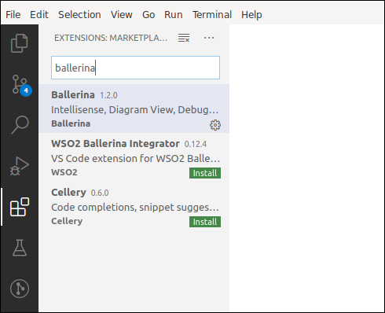

# Ballerina: Cloud-Native Middleware as a Programming Language

[Ballerina](http://ballerina.io) is a programming language for the cloud-era; specializing in creating network connected applications. It brings together the higher level abstractions of middleware technologies, along with the flexibility of a general-purpose programming language. 

In this workshop, we will take a look at how the Ballerina platform can be used effectively in creating microservices architectures. This is split into four main parts. 

A recording of a virtual session of this workshop can be found [here](https://www.youtube.com/watch?v=NFFbSRnzg3k).

## Prerequisites

### Ballerina
Download and install the latest Ballerina [distribution](https://ballerina.io/downloads/) suitable for your operating system. 

Run the following to test the installation:

```bash
$ ballerina version
jBallerina 1.2.6
Language specification 2020R1
Update Tool 0.8.8
```

### Visual Studio Code
Visual Studio Code is recommended as the editor for Ballerina projects. Install VS Code, and instal the Ballerina plugin by searching in "Extensions". 



### Docker/Kubernetes
- Mac - Install [Docker Desktop](https://store.docker.com/editions/community/docker-ce-desktop-mac)
- Windows - Install [Docker Desktop](https://store.docker.com/editions/community/docker-ce-desktop-windows)
- Linux - Install [Minikube](https://github.com/kubernetes/minikube)

### AWS CLI
For configuring AWS Lambda, install the [AWS CLI](https://docs.aws.amazon.com/cli/latest/userguide/install-cliv2.html). 

### Azure CLI
For configuring Azure Functions, install the [Azure CLI](https://docs.microsoft.com/en-us/cli/azure/install-azure-cli?view=azure-cli-latest). 

---

## Part 1: [Introduction to the Ballerina Language](./part1)
- Type system
- Functions
- Flow control
- Concurrency
- Visualizing the code: sequence diagrams
- Secure-by-default: taint analysis
- Language Integrated Query
- Java Interop

## Part 2: [Network Awareness](./part2)
- Network abstractions
  - Services/listeners/clients
  - Resources
  - Remote methods
- Programming Model
  - Non-blocking I/O
  - Resiliency
- Protocols
  - HTTP/S
  - gRPC
  - WebSockets

## Part 3: [Observability](./part3)
- Metrics – Integrating with Prometheus
- Distributed Tracing – OpenTracing

## Part 4: [Deployment](./part4)
- Docker/Kubernetes
- AWS Lambda
- Azure Functions
- GitHub Actions

### Workshop Duration and Audience
The workshop is designed to be finished in 5 hrs. The general audience consists of developers and architects. Prior basic knowledge of a programming language is required. 

---

#### Quick Reference
 - [Ballerina by Example](https://ballerina.io/learn/by-example/)
 - [API Documentation](https://ballerina.io/learn/api-docs/ballerina/)
---

#### New to computer programing? check out the Ballerina book for beginners:
[](https://www.amazon.com/Beginning-Ballerina-Programming-Novice-Professional/dp/1484251385/)

